# Laboratorio: CI/CD del backend Banco UdeA

Publiqué el backend del banco, hecho con Spring Boot 4.1.1 y Java 17, usando GitHub Actions, SonarCloud, Docker Hub y Render. La persistencia la dejé en H2 en memoria, así que no necesité un servidor de base de datos externo.

## 1. Cambios realizados al proyecto

- En el `pom.xml` agregué JaCoCo, definí el `finalName` como `banco`, puse las propiedades de Sonar y dejé H2 con alcance `runtime`.
- En `application.properties` configuré la conexión para que use H2 en memoria por defecto, y dejé `DB_URL`, `DB_USER`, `DB_PASSWORD` y `PORT` como variables de entorno que se pueden sobrescribir. Quité el driver y el dialecto de MySQL que estaban fijos para que Spring Boot e Hibernate los detecten a partir de la URL.
- Creé `BancoServicesTests` con pruebas de clientes y transferencias sobre los servicios.
- Creé el `Dockerfile` y el archivo `.github/workflows/build.yml`, con un pipeline de cinco jobs: tests, sonar, build, docker y deploy.

Como los datos viven en memoria, se pierden cuando el contenedor se reinicia, lo que en el plan Free de Render pasa después de periodos de inactividad.

## 2. Pruebas locales

Antes de subir nada, ejecuté las pruebas y levanté la aplicación en mi máquina:

```shell
./mvnw clean verify
./mvnw spring-boot:run
```

Revisé el reporte de cobertura en `target/site/jacoco/index.html`.

## 3. SonarCloud

1. Entré a https://sonarcloud.io con mi cuenta de GitHub e importé este repositorio.
2. En Administration > Analysis Method desactivé Automatic Analysis.
3. En Information copié el Project Key y el Organization Key.
4. En My Account > Security generé un token.

Cuando corrió el pipeline revisé el análisis de la rama `main`, con el Quality Gate y la cobertura:

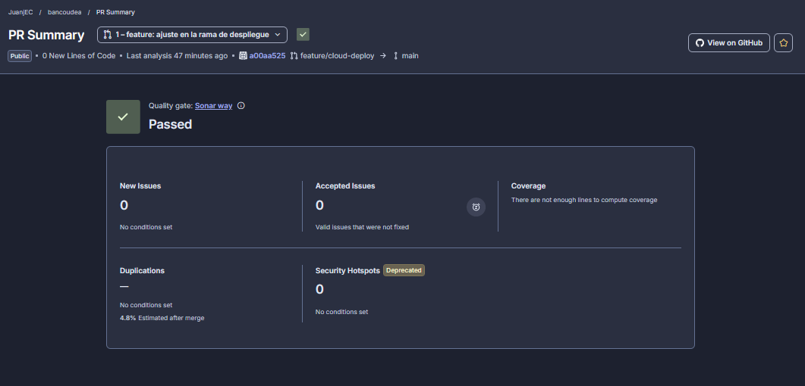

## 4. Docker Hub

1. Creé un repositorio público llamado `banco`.
2. Creé un Access Token con permisos de lectura y escritura.

El pipeline publicó la imagen con el tag `latest`:

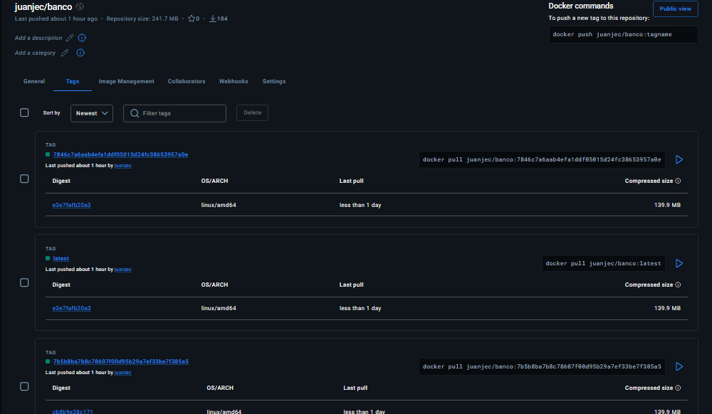

## 5. Secrets y variables en GitHub

Entré a Settings > Secrets and variables > Actions del repositorio y creé lo siguiente.

| Nombre | Tipo | Valor |
|---|---|---|
| `SONAR_TOKEN` | Secret | Token de SonarCloud |
| `DOCKER_USERNAME` | Secret | Usuario de Docker Hub |
| `DOCKER_PASSWORD` | Secret | Access token de Docker Hub |
| `RENDER_DEPLOY_HOOK_URL` | Secret | Deploy Hook del servicio en Render |
| `SONAR_PROJECT_KEY` | Variable | Project Key de SonarCloud |
| `SONAR_ORGANIZATION` | Variable | Organization Key de SonarCloud |

## 6. Primer push y publicación de la imagen

Subí los cambios a `main`:

```shell
git add .
git commit -m "Laboratorio 2"
git push origin main
```

En ese primer push el job `deploy` falló porque todavía no existía el hook de Render. Era lo esperado. Una vez configuré el hook, volví a ejecutar el pipeline y los cinco jobs (tests, sonar, build, docker y deploy) terminaron en verde:

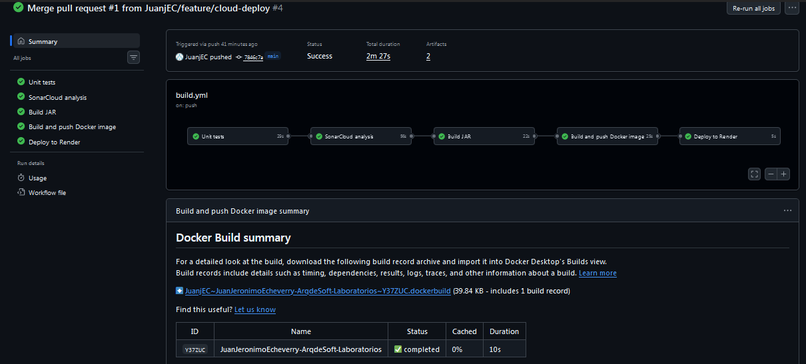

## 7. Render

1. Fui a New > Web Service > Existing Image.
2. Puse como Image path `docker.io/juanjec/banco:latest`.
3. Elegí el plan Free.
4. No agregué variables de entorno, porque `PORT` la define Render.
5. En Settings puse el Health Check Path en `/api/customers`.
6. Copié el Deploy Hook de Settings y lo guardé como el secret `RENDER_DEPLOY_HOOK_URL` en GitHub.

El servicio quedó en estado Live con su URL pública:

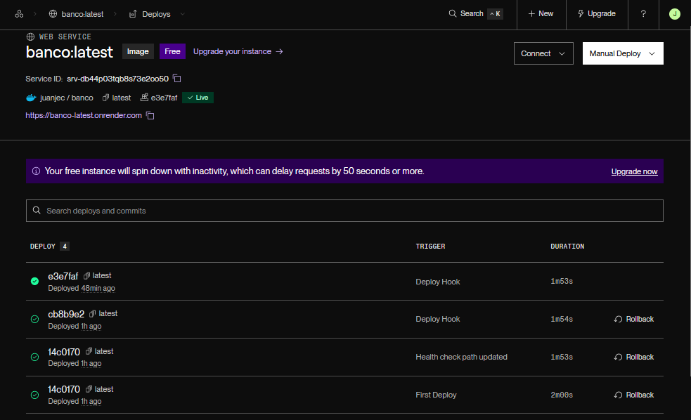

## 8. Trunk based con una segunda rama

Dejé configurada la rama `feature/cloud-deploy` en `build.yml`, bajo `on.push.branches`. Creé la rama desde `main`:

```shell
git checkout main
git pull origin main
git checkout -b feature/cloud-deploy
```

Hice un cambio agregando el README y lo subí:

```shell
git add .
git commit -m "feature: ajuste en la rama de despliegue"
git push -u origin feature/cloud-deploy
```

En GitHub abrí el Compare & pull request hacia `main`, esperé a que los checks pasaran en verde e hice el Merge pull request. El push resultante en `main` ejecutó el pipeline completo y desplegó en Render.

Este es el pull request con los checks y el merge hacia `main`:

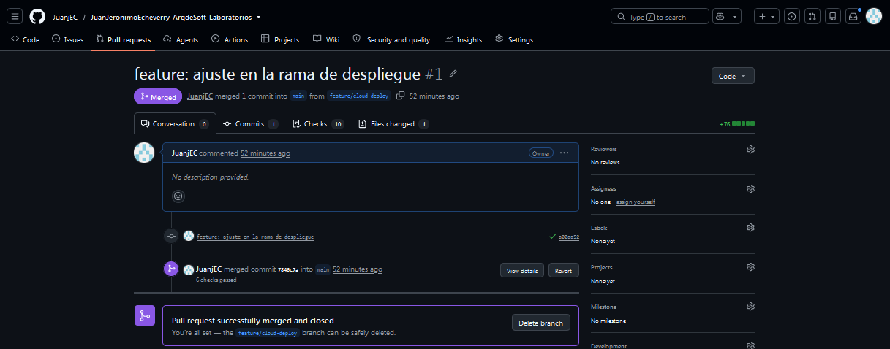

Para ver el historial de ramas ejecuté:

```shell
git log --graph --oneline --all
```

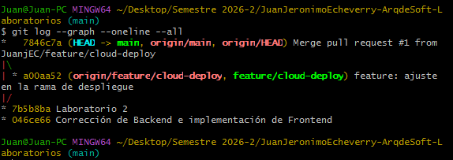

## 9. Pruebas del backend en la nube

Probé el backend desplegado con Postman, usando la URL pública de Render. Como los datos están en memoria, hice todas las peticiones seguidas. Estas son las pruebas (en la primera petición tras un rato de inactividad tardó unos segundos, porque en el plan Free Render suspende el servicio):

Primero consulté el listado de clientes, que estaba vacío:

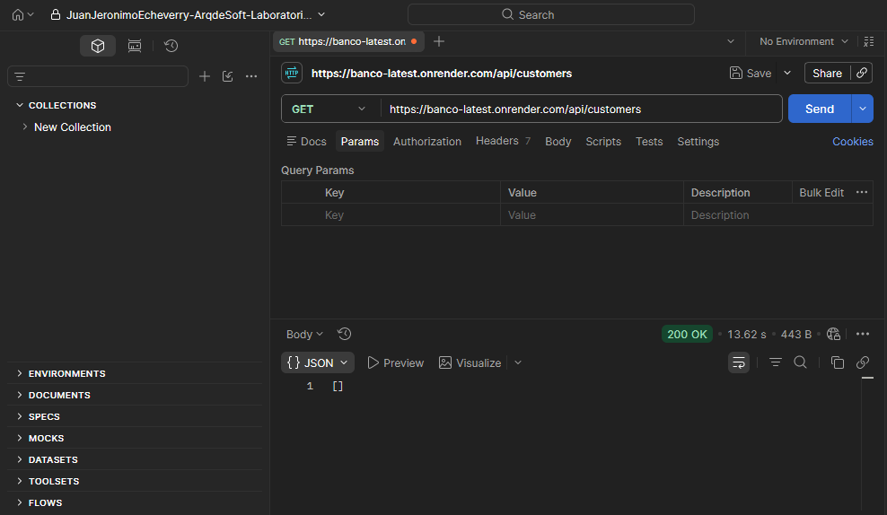

Luego creé el primer cliente:

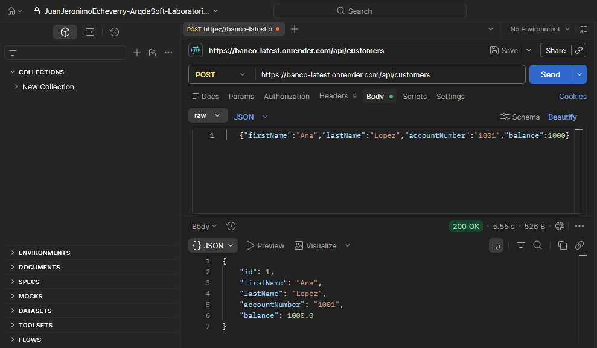

Después creé el segundo cliente:

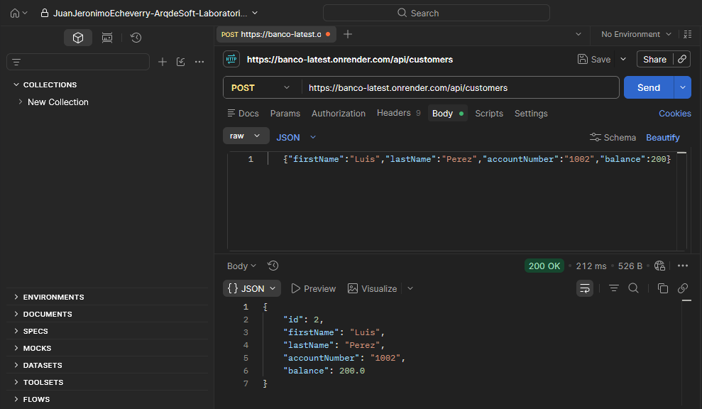

Hice una transferencia entre las dos cuentas:

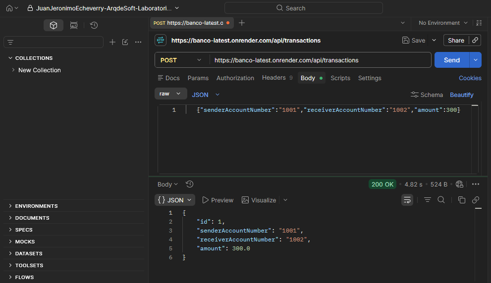

Consulté el historial de transacciones de la cuenta origen:

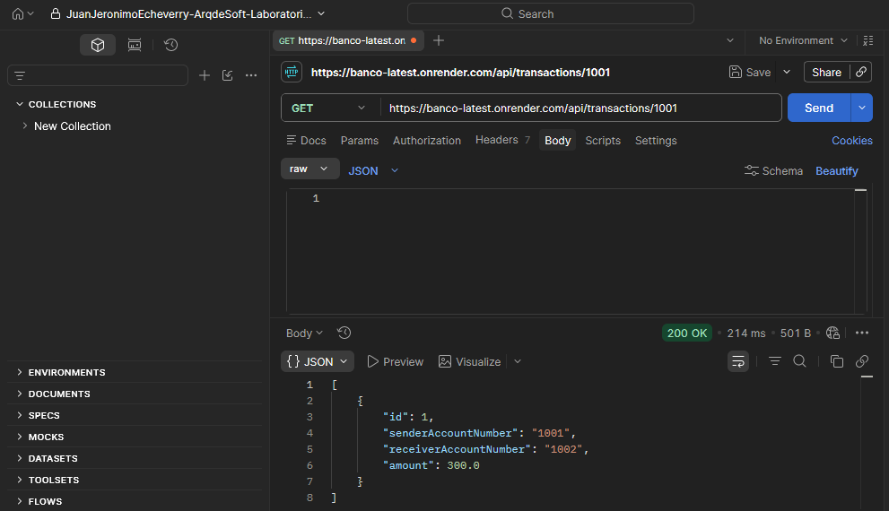

Por último volví a listar los clientes y verifiqué que los saldos quedaron actualizados:

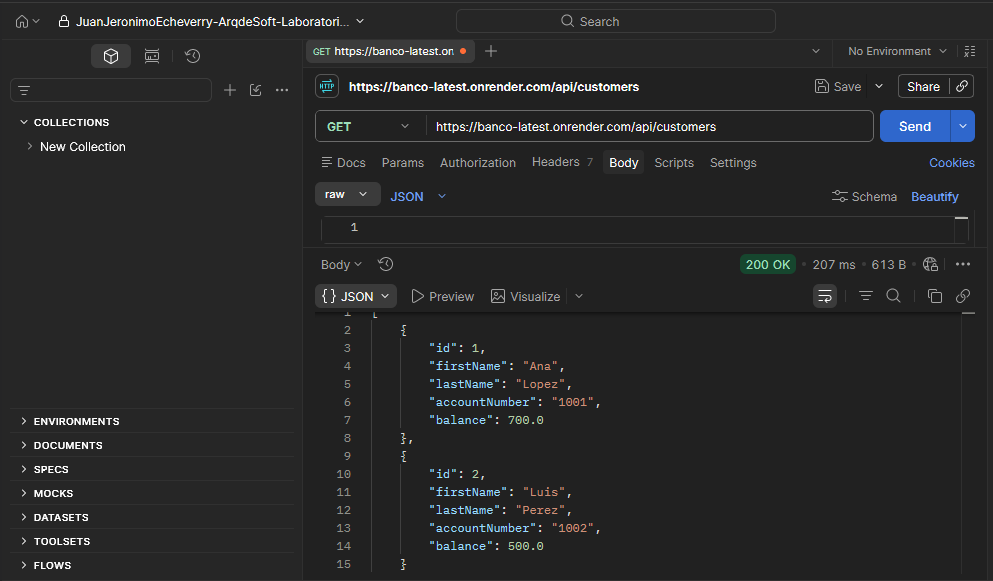

## 10. Pruebas desde el frontend

El proyecto incluye un frontend en `banco-frontend`, hecho con HTML y JavaScript plano, sin compilación. Abrí `banco-frontend/index.html` en el navegador y, en el campo API de la barra lateral, escribí la URL pública de Render en lugar de `http://localhost:8080`. El backend permite el acceso desde cualquier origen en `/api/**`, así que no hubo problemas de CORS.

Al iniciar, el listado de clientes estaba vacío:

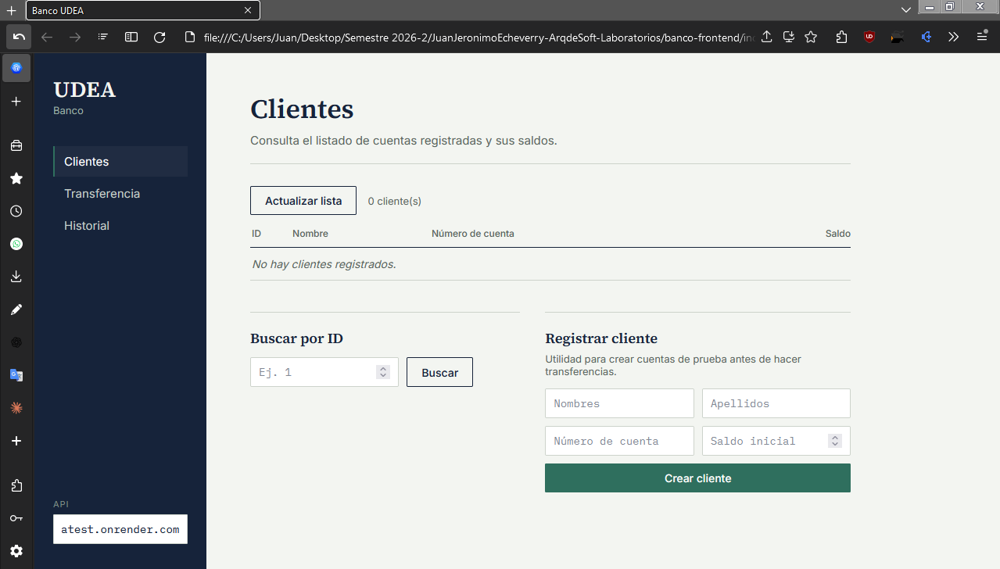

Creé el primer cliente:

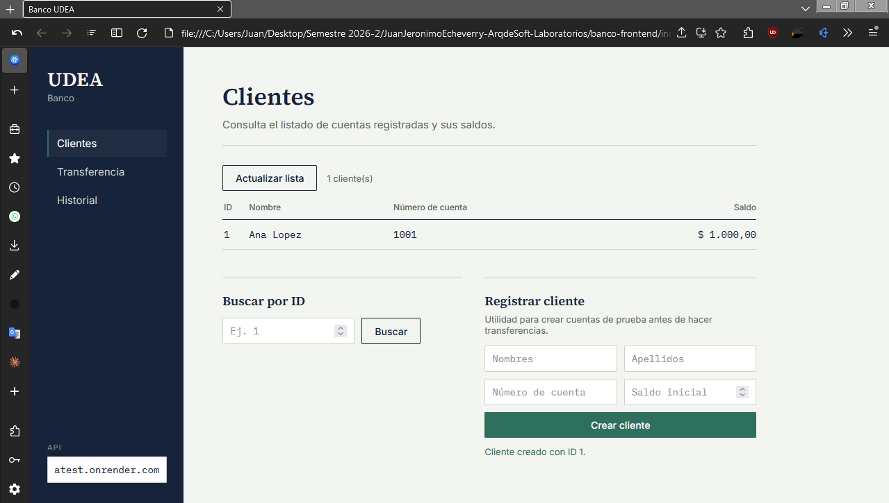

Creé el segundo cliente:

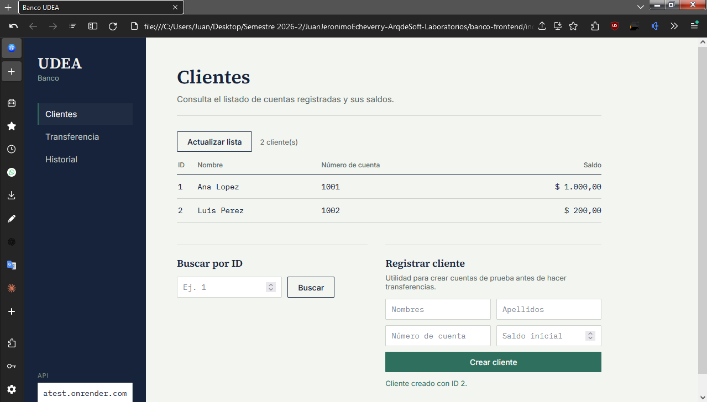

Hice una transferencia entre las cuentas:

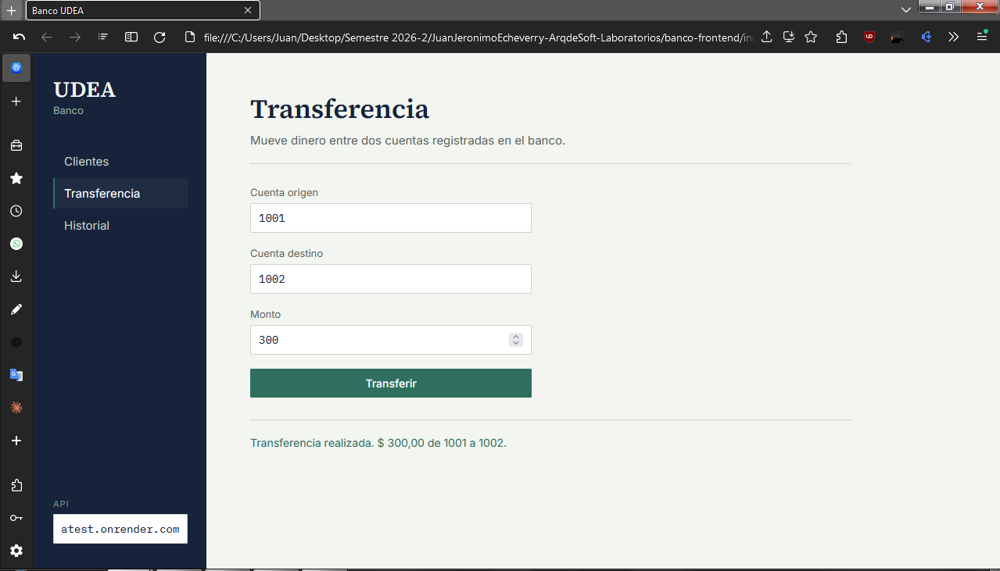

Revisé el historial de transacciones:

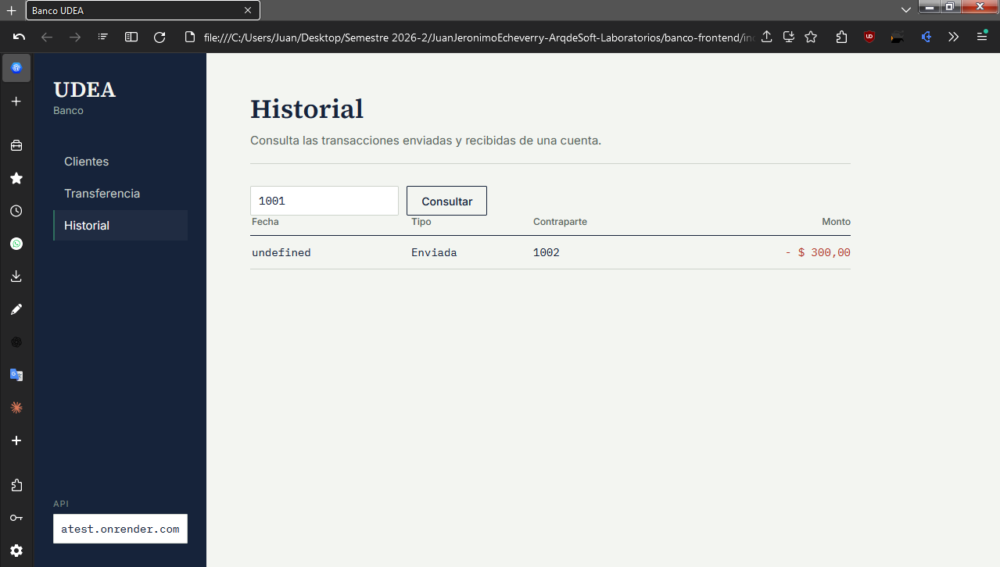

Finalmente consulté el listado de clientes con los saldos actualizados:

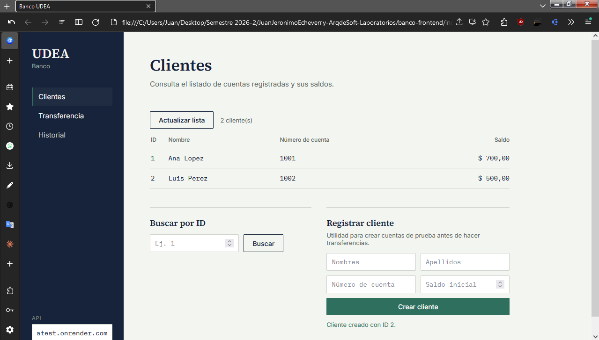

## 11. Snyk

1. Entré a https://snyk.io con mi cuenta de GitHub.
2. En Add projects elegí GitHub y seleccioné este repositorio.
3. Cuando terminó el escaneo abrí View report.

Este fue el resultado del escaneo del `pom.xml` y del `Dockerfile`:

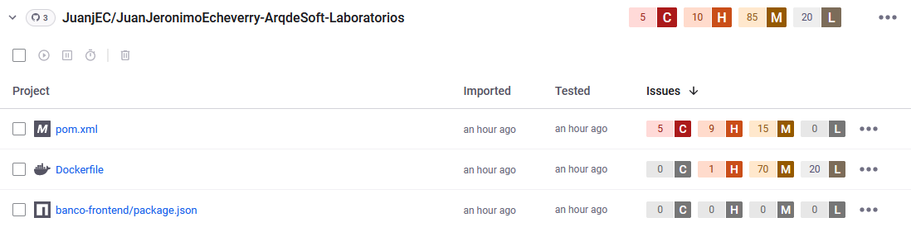